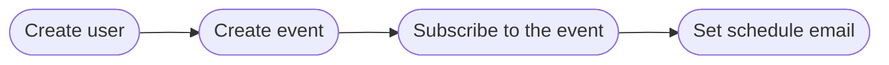

## First Time Setup

- Create virtual env

```
python -m venv env
```

- Create `.env` file
- Install python packages.

```
pip3 install -U -r requirements.txt
```
- Run db setup
```
flask db init
flask db migrate
flask db upgrade
```
- Run `flask run`
- Run celery `celery -A run.celery worker --loglevel=info --pool=threads --concurrency=8`

## API Endpoints

<details>
<summary><code>POST</code> <code><b>/api/events</b></code> <code>(create new event)</code></summary>

##### Parameters

> | name | type | data type |
> |------|------|-----------|
> | name | required | string |

##### Example cURL

> ```bash
> curl -X POST -H "Content-Type: application/json" -d '{"name": "Test Event"}' http://127.0.0.1:5000/api/events
> ```
</details>

<br>

<details>
<summary><code>POST</code> <code><b>/api/users</b></code> <code>(create new user)</code></summary>

##### Parameters

> | name | type | data type |
> |------|------|-----------|
> | email | required | string |

##### Example cURL

> ```bash
> curl -X POST -H "Content-Type: application/json" -d '{"email": "example@gmail.com"}' http://127.0.0.1:5000/api/users
> ```
</details>

<br>

<details>
<summary><code>GET</code> <code><b>/api/user/<b>{id}</b>/events</b></code> <code>(gets event subsribed by user)</code></summary>

##### Parameters

> | name | type | data type |
> |------|------|-----------|
> | id | required | int |

##### Example cURL

> ```bash
> curl -X GET -H "Content-Type: application/json" http://127.0.0.1:5000/api/user/7/events
> ```
</details>

<br>

<details>
<summary><code>POST</code> <code><b>/api/subscribe</b></code> <code>(subscribe to the event)</code></summary>

##### Parameters

> | name | type | data type |
> |------|------|-----------|
> | email | required | string |
> | event_id | required | int |

##### Example cURL

> ```bash
> curl -X POST -H "Content-Type: application/json" -d '{"email": "example@gmail.com", "event_id": 5}' http://127.0.0.1:5000/api/subscribe
> ```
</details>

<br>

<details>
<summary><code>POST</code> <code><b>/api/unsubscribe</b></code> <code>(unsubscribe to the event)</code></summary>

##### Parameters

> | name | type | data type |
> |------|------|-----------|
> | email | required | string |
> | event_id | required | int |

##### Example cURL

> ```bash
> curl -X POST -H "Content-Type: application/json" -d '{"email": "example@gmail.com", "event_id": 5}' http://127.0.0.1:5000/api/unsubscribe
> ```
</details>

<br>

<details>
<summary><code>POST</code> <code><b>/api/save_emails</b></code> <code>(create new schedule email)</code></summary>

##### Parameters

> | name | type | data type | example |
> |------|------|-----------|---------|
> | event_id | required | int | |
> | email_subject | required | string | |
> | email_content | required | string | |
> | timestamp | required | datetime string | 2024-01-01 23:59 |

##### Example cURL

> ```bash
> curl -X POST -H "Content-Type: application/json" -d '{"event_id": 1, "email_subject": "Lorem ipsum", "email_content": "Lorem ipsum dolor sit amet, consectetur adipiscing elit, sed do eiusmod tempor incididunt ut labore et dolore magna aliqua. Eleifend donec pretium vulputate sapien.", "timestamp": "2024-01-01 23:59"}' http://127.0.0.1:5000/api/save_emails
> ```
</details>

## Note
- Schedule email timestamp param always GMT+8, on DB the timestamp is BIGINT unix epoch
- Tested on Windows and Python 3.12.2

General usage:
